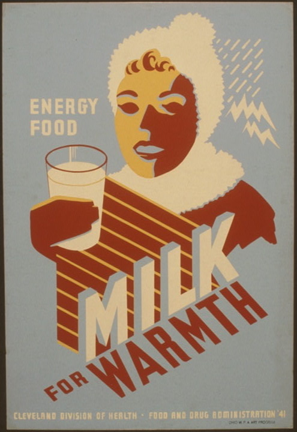

Still working on this!

## The Question 

Throughout six years of working on a public television show about Maryland agriculture, I learned a lot about the difficulties of being a farmer. One type of farmer always stood out as struggling the most: dairy farmers. The number of dairy farms in my home state has fallen from [1,400 in 1990](https://mda.maryland.gov/Documents/2010dairyreportfinal.pdf) to [340 in 2019](https://americanfarmpublications.com/md-dairy-industry-still-facing-struggles/). This change has also been seen [more broadly across the United States](https://www.fb.org/market-intel/usda-report-u-s-dairy-farm-numbers-continue-to-decline), where the number of licensed dairy herds fell from around 70,000 in 2003 to 31,000 in 2020. 

Some of this decline is believed to be due to the growing popularity of plant-based milk alternatives. Products like oat milk and almond milk, that would have seemed like oddities just 20 years ago, are now staples at coffee shops and grocery stores. 

I would like to see if there is data to support that people are replacing dairy milk with plant-based milk. Milk has long been an important part of the American diet. Twenty-two states have even designated milk as their state beverage. 

 

Using this data as a starting point, I could look further into what is causing this shift away from dairy milk (if there is a noticeable shift). Is it more dairy sensitivity in the population? More veganism? More climate change-conscious consumers? That could be a next step in this reporting. 

## The Data 

These are the initial data-points I would like to collect: 
- Pounds of dairy milk purchased in the U.S., 1980-2022 
- Pounds of soy milk purchased in the U.S., 1980-2022 
- Pounds of almond milk purchased in the U.S., 1980-2022 
- Pounds of oat milk purchased in the U.S., 1980-2022 

I picked pounds over dollars sold because it’s easier to compare across years, price fluctuations, and the fact that certain milks cost more than others. I would gather dairy milk data from the [U.S. Department of Agriculture](https://www.ams.usda.gov/resources/marketing-order-statistics/estimated-fluid-milk-sales). I would get plant-based milk data through the market research company [IRI](https://www.iriworldwide.com/en-us/insights/blog/beyond-milk-and-meat-plant-based-foods-continue-to-sprout-new-growth-across-categories), which collects data about consumer spending. The USDA has cited their numbers in their work. 

As a follow up, I would conduct a survey of both dairy and plant-based milk drinkers and get the reasoning behind their decision to consume one or the other or both. 

Here’s a preliminary data sample: (I am struggling to find plant-based milk data not behind a paywall. I've found some market share data, but not pounds or gallons.) 

| Year | Dairy Milk (millions pounds)| Soy Milk | Almond Milk |  
| ----------- | ----------- | ----------- | ----------- | 
| 2021 | 41,537 | ? | ? | 
| 2020 | 43,341 | ? | ? | 
| 2019 | 43,659 | ? | ? | 
| 2018 | 44,482 | ? | ? | 
| 2017 | 45,484 | ? | ? | 
