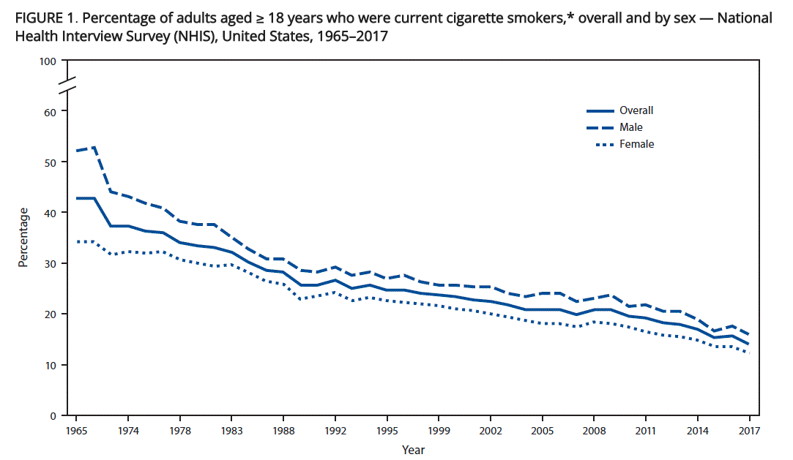

# Is vaping turning into the new smoking? A snapshot of American nicotine use 

When Steve Antonelli started smoking at age 24 in 1995, it felt like the norm. He was hanging out at bars, surrounded by people puffing on cigarettes, standing in their clouds of smoke. Cigarettes had been banned on airplanes five years earlier, but in the places Antonelli was spending time, he could still find groups of fellow smokers. 

“I think it was the tail end of smoking being somewhat accessible and not quite as stigmatized,” Antonelli said. 

These days, smoking is no longer the social hobby it once was for Antonelli. It’s now a “bad habit,” relegated to outside of buildings and away from friends. 

 
*Graph courtesy of the Centers for Disease Control and Prevention* 

In 1995, around a quarter of American adults smoked, according to the National Health Interview Survey (NHIS). But its numbers were declining, down from the country’s peak of 45% in 1965. Data from the National Survey on Drug Use and Health (NSDUH) shows that just over one in six adults are cigarette smokers in 2021.  

## E-cigarettes' worrisome popularity among American youth 

E-cigarettes were the second-most used method of nicotine consumption after cigarettes in 2021. E-cigarettes, which are commonly known as “vapes,” produce an aerosol that contains nicotine, flavorings, and other chemicals. While just under 5% of adults used vapes in 2021, NSDUH data shows that e-cigarettes are more popular than traditional cigarettes for people between 12 and 20 years old. Respondents between the ages of 21 and 25 are about equal in their use of cigarettes versus e-cigarettes. For those 26 and up, cigarettes are the clear preference, with vape use declining more and more as users get older.  

[Chart showing the percentage of Americans by age group who have vaped nicotine in the past month](https://docs.google.com/spreadsheets/d/e/2PACX-1vRWTKQSOjEHSpWSjN_SRrU2qVrIdf9730PnnpJshX9vOz-_RTNJbzXb2XOvvlhnAHlaZm4fzzw0vD2h/pubchart?oid=2106503104&format=interactive) 

Youth e-cigarette use has been a growing worry in in American public health circles. In 2018, [U.S. Surgeon General Jerome Adams declared youth vaping an “epidemic”](https://e-cigarettes.surgeongeneral.gov/documents/surgeon-generals-advisory-on-e-cigarette-use-among-youth-2018.pdf). In his statement, Adams cited a Centers for Disease Control and Prevention (CDC) report that found e-cigarette use among middle and high schoolers increased 900% between 2011 and 2015. 

[Graph showing the percentage of middle and high school students who have used e-cigarettes in the past 30 days](https://docs.google.com/spreadsheets/d/e/2PACX-1vRWTKQSOjEHSpWSjN_SRrU2qVrIdf9730PnnpJshX9vOz-_RTNJbzXb2XOvvlhnAHlaZm4fzzw0vD2h/pubchart?oid=266831998&format=interactive) 

Data from the National Youth Tobacco Survey (NYTS) shows the climb in e-cigarette popularity among sixth through 12th graders between 2012 and 2019. The percentage of young people who vape peaked in 2019, with one in five middle and high school students using e-cigarettes. 

It’s important to note that due to methodological changes in 2020, the CDC has said results from that year forward cannot be compared with data from previous years. In only looking at data from 2020 through 2022, the percentage of youth vapers is still in flux. As of 2022, the number sits below 10% of middle and high schoolers. 

Meredith Berkman, co-founder of the group [Parents Against Vaping e-cigarettes](https://www.parentsagainstvaping.org/), has been on the frontlines fighting against this youth epidemic. Berkman first became interested in the topic in 2018 when her 16-year-old son told her there had been a mixed-message anti-addiction talk at his New York City high school. An outside group had come to talk to the students about addiction without teachers or school administrators in the room. What struck Berkman’s son as odd was how insistent one speaker was that Juul, a brand of e-cigarette, was safe. 

“And so every time he would say, ‘This is for adults, not for kids,’ he would repeatedly follow this up by saying, ‘It’s totally safe,’” Berkman recalled her son telling her.  

Within 24 hours, Berkman and two of her friends, who also had sons at the school, discovered that the speaker was a Juul representative who came with the outside group without the school’s knowledge. She continued researching and learning about what was behind the recent uptick in youth vaping. E-cigarette companies were marketing directly to middle and high schoolers on social media. Companies also created pods with fruity, sweet, and menthol flavors that would appeal to younger users. 

When Berkman and her friends discovered the scope of the youth vaping problem, they decided to start Parents Against Vaping e-cigarettes (PAVe) to educate parents around the country about the dangers of youth tobacco use and the predatory behavior of the tobacco industry. They also advocate against flavored vape pods, which a [study in the journal Pediatrics](https://www.ncbi.nlm.nih.gov/pmc/articles/PMC6856781/) found can be a gateway to nicotine addiction. According to the CDC, nicotine can harm the developing brains of adolescents, including the parts that control attention, learning, mood, and impulse control. 

As part of her work with PAVe, Berkman testified about the issue before Congress, worked with states’ attorneys general that have sued Juul, and helped pass laws in California and Massachusetts to ban the sale of flavored tobacco products. 

Berkman hopes this work has helped cause a decrease in youth vaping, but she’s nots ure the NYTS numbers showing a decline after 2019 are correct. She believes e-cigarette use is underreported due to survey methodology changes and the quick-shifting tactics tobacco companies use that NYTS questions for students can’t keep up with. Even if the survey numbers are correct, they’re still too high for her liking. 

“Two-point-five million kids using these products is 2.5 million too many,” Berkman said. “No child should be using a tobacco product, full stop.” 

## E-cigarettes as harm reduction? 

Public health professionals would also like to continue the decrease in the number of adults using tobacco products. According to Michael Pesko, a health economist studying tobacco policy, one way to reduce the harm caused by tobacco consumption may be by increasing adult vaping rates.  

Pesko says several government-commissioned reports have shown that e-cigarettes are “far less harmful” to consumers than combustible tobacco products, like cigarettes. He likens using e-cigarettes for nicotine addiction to methadone used for opioid addiction; they could be a powerful harm reduction method. 

“Combustible tobacco kills nearly 500,000 annually in the United States,” Pesko said, “so vaping instead of smoking will increase your chances of living a healthier and longer life.” 

[Graph of current adult cigarette smokers vs. e-cigarette users](https://docs.google.com/spreadsheets/d/e/2PACX-1vRWTKQSOjEHSpWSjN_SRrU2qVrIdf9730PnnpJshX9vOz-_RTNJbzXb2XOvvlhnAHlaZm4fzzw0vD2h/pubchart?oid=1533604597&format=interactive) 

For now, e-cigarette uptake remains low among smokers, especially those older than 30. Pesko attributes a lot of that to public misperceptions that vapes are as dangerous as cigarettes. But for Steve Antonelli, who has experimented with vaping on-and-off for ten years to try and wean off cigarettes, it just couldn't take the place of his almost 30-year-old cigarette habit.  

“It’s not the same thing as smoking,” Antonelli said. “It doesn’t feel the same.” 
